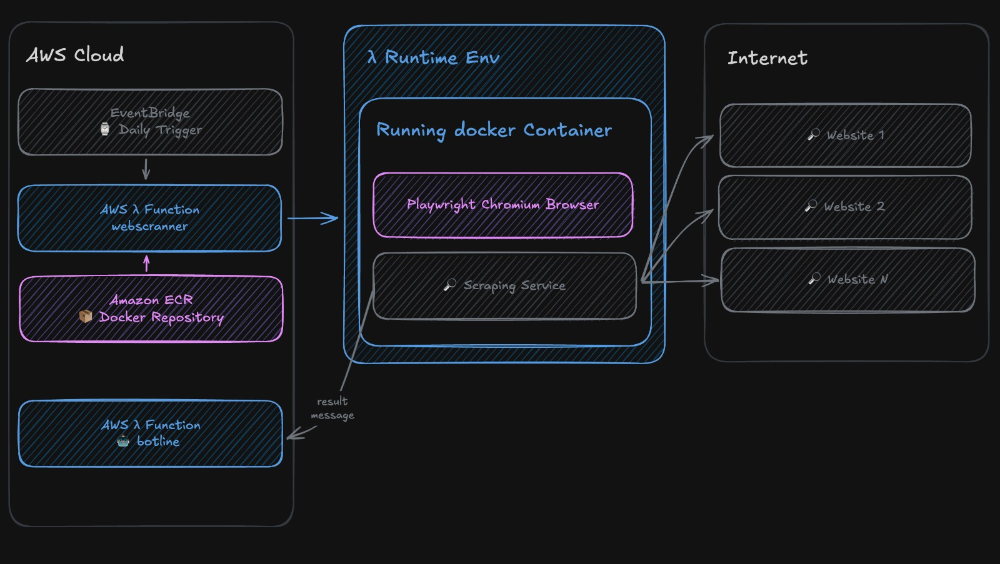

# Web Scraper Service

A serverless web scraper that extracts content from specified websites and returns structured data for downstream processing. This service focuses solely on scraping and organizing responses - other services handle summarization, keyword matching, and storage.

## Communication Flow



1. **EventBridge** triggers the Lambda function daily using a cron schedule (`rate(1 day)`)
2. **Lambda Function** pulls the Docker container image from Amazon ECR and executes it
3. **Docker Container** runs inside Lambda's execution environment containing:
   - **Playwright** with headless Chromium browser to scrape configured websites
   - **Scraper Service** that extracts content, cleans it, and structures the response
4. **Notification Service** receives real-time updates via HTTP POST to `BOTLINE_ENDPOINT`

## 🚀 Quick Start

### Prerequisites

- Node.js 18+
- pnpm
- Docker
- AWS CLI configured

### Installation

```bash
# Install dependencies
pnpm install

# Build the project
pnpm build

# Build docker /scripts/docker-build.sh
chmod +x /scripts/docker-build.sh

# Run docker /scripts/docker-run.sh
/scripts/docker-run.sh

# Test the function
curl -XPOST "http://localhost:9000/2015-03-31/functions/function/invocations" -d '{}'
```

### AWS Deployment

1. Auth AWS, Create ECR repository, Build and tag the Docker image, Push to ECR.

```bash
# Bash
IMAGE_TAG=your-tag ./scripts/_main-deploy-to-ecr.sh
```

```powershell
# PowerShell
.\scripts\_main-deploy-to-ecr-win.ps1 [-Tag <string>]
```

## 📁 Project Structure

```
src/
├── index.ts                 # Main Lambda handler
├── scraper/                 # Web scraping logic
│   ├── scraper-service.ts   # Playwright-based scraper
│   └── mock-scraper-service.ts # Mock scraper for local development
└── utils/                   # Utilities and configurations
    └── website-configs.ts   # Website scraping configurations
```

### Network & Security

- Lambda has ECR permissions to pull the container image
- Outbound HTTPS connections to target websites (no VPC required)
- External notification service accessed via environment variables (`BOTLINE_TOKEN`)
- Container runs in AWS Lambda's managed runtime environment

## 📊 Response Format

The service returns a structured JSON response with scraped content:

```json
{
  "success": true,
  "timestamp": "2025-08-21T10:30:00.000Z",
  "sitesProcessed": 2,
  "totalSitesConfigured": 2,
  "results": [
    {
      "name": "Australian Embassy in Argentina - Twitter",
      "url": "https://x.com/EmbAustraliaBA",
      "title": "Page Title",
      "content": "Scraped content...",
      "keywords": ["keyword1", "keyword2"],
      "contentLength": 1250,
      "scrapedAt": "2025-08-21T10:30:00.000Z",
      "status": "success"
    }
  ],
  "executionTime": 5432
}
```

### 🎯 Service Boundaries

This service is **responsible for**:

- Web scraping using Playwright
- Content extraction and cleaning
- Structured response formatting
- Error handling and resilience

This service is **NOT responsible for**:

- Content summarization (handled by downstream services)
- Keyword matching (handled by downstream services)
- Data storage (handled by downstream services)
- File system operations

## 🛠️ Scripts

We have a couples one, you can check package.json for the basic ones and ./scripts for more.
